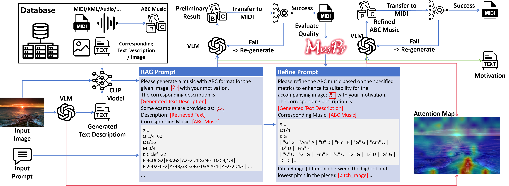

# Image2Music

**Article:** Zijian Zhao*, Dian Jin, Zijing Zhou, "[Zero-Effort Image-to-Music Generation: An Interpretable RAG-based VLM Approach](https://dl.acm.org/doi/10.1145/3805622.3810723)", ACM ICMR 2026


## 1. Worflow




## 2. Dataset

[amaai-lab/MidiCaps · Datasets at Hugging Face](https://huggingface.co/datasets/amaai-lab/MidiCaps)

Please rename the `train.json` as `meta.txt`.

The data process part is based on the code of [jwdj/EasyABC: EasyABC (github.com)](https://github.com/jwdj/EasyABC).


## 3. Run the Model

```shell
python main.py
```


## 4. Citation

```
@inproceedings{zhao2026zero,
author = {Zhao, Zijian and Jin, Dian and Zhou, Zijing},
title = {Zero-Effort Image-to-Music Generation: An Interpretable RAG-based VLM Approach},
year = {2026},
isbn = {9798400726170},
publisher = {Association for Computing Machinery},
address = {New York, NY, USA},
url = {https://doi.org/10.1145/3805622.3810723},
doi = {10.1145/3805622.3810723},
booktitle = {Proceedings of the 2026 International Conference on Multimedia Retrieval},
pages = {2793–2797},
numpages = {5},
keywords = {Image-to-Music Generation (I2M), Vision Language Model (VLM), Retrieval-Augmented Generation (RAG), Music Information Retrieval (MIR), Symbolic Music, Multi-Modal, Interpretability},
series = {ICMR '26}
}
```


## 5. Links

Some websites provide the service for abc2midi and midi2abc:

[midi2abc (marmooo.github.io)](https://marmooo.github.io/midi2abc/)

[ABC notation converter - Nota ABC (notabc.app)](https://notabc.app/abc-converter/)