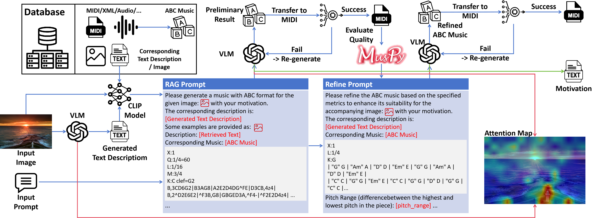

# Image2Music


## 1. Worflow




## 2. Dataset

[amaai-lab/MidiCaps · Datasets at Hugging Face](https://huggingface.co/datasets/amaai-lab/MidiCaps)

Please rename the `train.json` as `meta.txt`.

The data process part is based on the code of [jwdj/EasyABC: EasyABC (github.com)](https://github.com/jwdj/EasyABC).


## 3. Run the Model

```shell
python main.py
```


## 4. Citation

```

```


## 5. Links

Some websites provide the service for abc2midi and midi2abc:

[midi2abc (marmooo.github.io)](https://marmooo.github.io/midi2abc/)

[ABC notation converter - Nota ABC (notabc.app)](https://notabc.app/abc-converter/)